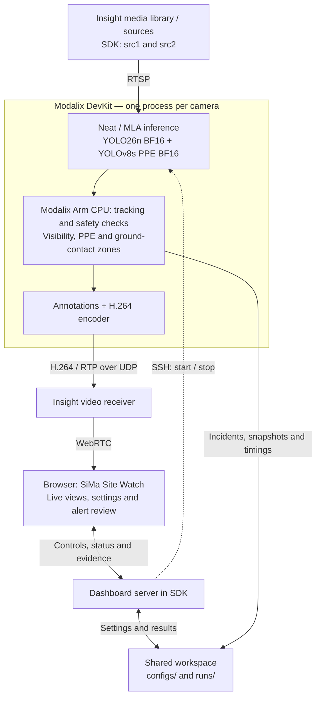

# SiMa Site Watch

Monitor construction-site video with **SiMa.ai Neat on Modalix**. Detect people,
highlight workers entering user-defined danger zones, and record missing-hardhat
or missing-vest observations with timestamps, tracked person IDs, and snapshots.
The dashboard provides two camera views, polygon editing, video/source controls,
stream aliases, and an alert review with snapshots and JSON exports. Use it to
demonstrate restricted-area entry and missing-PPE monitoring across site views.

Both compiled models run on Modalix: **YOLO26n** detects people on each processed
frame; a **fine-tuned YOLOv8s PPE model** supplies PPE and machinery detections every
third frame. Tracking, zone checks, and incident logging run on Modalix's Arm CPU.
The dashboard and Insight run in the Neat Development Environment (SDK).

This is a demonstration of visual safety monitoring. Zones approximate ground
contact in the image; they do not measure physical clearance. Person IDs apply
only within a camera session.

## Architecture

The diagram shows the **direct video transport** configuration. Each camera has
its own inference process, tracking IDs, zone policy, and review session.



Both neural networks execute on Modalix's MLA; tracking and incident decisions run
on its on-chip Arm CPU. Both are inside the DevKit: Modalix is a system-on-chip
containing an application CPU, a machine learning accelerator (MLA), and other
processing engines. The CPU label identifies which engine runs the application
logic. Insight supplies the input videos and delivers the annotated output to
the browser. The dashboard uses Insight's API for source control and WebRTC
signaling, saves camera policies in `configs/`, and reads evidence from `runs/`.
SSH controls camera processes even with direct video enabled. The optional
`video_transport: "ssh"` mode also relays device output through SSH before Insight;
the Insight-to-browser leg still uses WebRTC.

## 1. Prerequisites and setup

- Modalix DevKit with a compatible Neat runtime and device Python environment
  containing `pyneat`, NumPy, and OpenCV.
- Neat Development Environment with Insight running, Python 3.10+, and SSH access
  to the device without interactive password prompts.
- This checkout shared between SDK and device at the **same absolute path**.
- Access to [SiMa Model Zoo](https://developer.sima.ai/software/tools/model-zoo/)
  and the compiled PPE archive described below.

Run these commands inside the SDK:

```bash
git clone https://github.com/SiMa-ai/apps-construction-safety-ppe-demo.git
cd apps-construction-safety-ppe-demo
bash scripts/setup.sh
insight-admin status
neat --json
```

Use the addresses and exposed ports reported by `neat --json`. The device must
be able to reach the SDK host's RTSP port. See the
[Insight guide](https://developer.sima.ai/software/tools/insight/) for service setup.

On the device, verify the Python interpreter you will configure:

```bash
~/pyneat/bin/python -c 'import pyneat, cv2, numpy; print("Device imports OK")'
```

The setup script creates an SDK-local `.venv`; it does not install the device
runtime. The current package dependencies also install Ultralytics, but the
compiled inference path uses Neat and does not invoke PyTorch.

## 2. Download the compiled models

No training, ONNX export, or compilation is needed to run with the supplied
compiled packages. Keep the archives intact: **do not untar them**.

| Purpose | Provider | File expected under `models/` |
| --- | --- | --- |
| People detection | SiMa Model Zoo | `yolo26n-det-bf16-mla_tess-b1.tar.gz` |
| PPE and machinery detection | Hugging Face release (publication pending) | `ppe-yolov8s-bf16-modalix.tar.gz` |

### YOLO26n — SiMa Model Zoo

Install/authenticate [sima-cli](https://developer.sima.ai/software/tools/sima-cli/),
then download the Modalix BF16 package:

```bash
mkdir -p models
sima-cli login
sima-cli download \
  https://docs.sima.ai/pkg_downloads/SDK2.1.3/models/modalix/yolo26-detection/yolo26n-det-bf16-mla_tess-b1.tar.gz \
  --dest models
```

This is the Model Zoo package selected for this demo. Use a Neat/platform release
compatible with it; the Model Zoo version alone does not specify your runtime version.

### YOLOv8s PPE — Hugging Face

**The public PPE repository, pinned revision, and release checksum are not yet
provided.** Until publication, place your locally validated compiled PPE package
at `models/ppe-yolov8s-bf16-modalix.tar.gz`.

Once published, replace the placeholders below with the release's organization,
repository, and full commit hash, then verify against its published SHA-256:

```bash
curl --fail --location \
  'https://huggingface.co/ORG/REPO/resolve/COMMIT_SHA/ppe-yolov8s-bf16-modalix.tar.gz' \
  --output models/ppe-yolov8s-bf16-modalix.tar.gz
sha256sum models/*.tar.gz
```

Use a compiled Neat-compatible archive, not the original Kaggle `.pt` checkpoint.
[configs/neat-yolo26-ppe.json](configs/neat-yolo26-ppe.json) defines the model paths,
decoders, class mappings, and PPE sampling interval. Keep those contracts matched
to the downloaded models.

For releases providing a completed `models/modalix-release.json`, the bundled
helper downloads both models and checks their hashes:

```bash
python3 scripts/fetch_modalix_models.py --check-manifest
python3 scripts/fetch_modalix_models.py
python3 scripts/fetch_modalix_models.py --verify-only
```

That manifest is not currently bundled in Git; these helper commands require the
completed release manifest. Model binaries and runtime outputs are excluded from Git.

## 3. Configure cameras and Insight

Upload your demonstration videos to Insight's media library. Source assignment,
playback, and output-channel selection can then be controlled from the dashboard.

For an existing setup, edit [configs/dashboard.json](configs/dashboard.json).
For a fresh setup, the interactive configurator prompts for device and network
settings and creates `dashboard.json`, `src1.json`, and `src2.json`:

```bash
.venv/bin/python scripts/control_camera.py configure
```

If those files already exist, edit them in place to preserve your zones and routes.
Use `configure --force` only to replace the setup; it backs up existing files under
`runs/config-backup-*/` and generates new camera policies with empty zones.

The main settings in `dashboard.json` are:

| Setting under `runtime` | Value to provide |
| --- | --- |
| `ssh_target` | Device SSH user and address, e.g. `USER@DEVICE_HOST` |
| `python` | Absolute device Python path, e.g. `/home/USER/pyneat/bin/python` |
| `insight_host` | SDK host address reachable from Modalix |
| `rtsp_port` | Exposed Insight RTSP host port from `neat --json` |
| `backend` | Keep `neat-device` |
| `detector_config` | Keep `configs/neat-yolo26-ppe.json` |
| `video_transport` | `direct` for device-to-Insight UDP, or `ssh` for the relay fallback |
| `video_host` | Insight's reachable UDP receiver for `direct`; device loopback for `ssh` |
| `video_port_base` | Receiver base port; output channel is added to this value |

The dashboard plays annotated H.264 through WebRTC. SDP signaling uses the
dashboard server; media flows directly from Insight
to the browser. Zone editing and incident snapshots still use JPEG images.

For direct device output, set `video_transport: "direct"`, `video_host` to the
Insight receiver reachable from Modalix, and `video_port_base` to its published
UDP base (normally 9000). The input `insight_host` may differ from `video_host`.
`video_transport: "ssh"` remains a fallback for the device-to-Insight leg.

For the four-channel Colima setup used by this demo, publish UDP 9000–9003 for
annotated video ingest and 40000–40007 for WebRTC, matching your Insight installation.
The working direct setup uses a bridged Colima VM address reachable from Modalix
and the browser. Insight must advertise a reachable address in its ICE candidates.
Forwarding dashboard port 8765 alone does not carry WebRTC media. Keep the RTSP
port reachable from the device as well.

The initial routing is:

| Camera policy | Insight input | Dashboard/output channel |
| --- | --- | --- |
| [configs/src1.json](configs/src1.json) | `src1` | 0 |
| [configs/src2.json](configs/src2.json) | `src2` | 1 |

Leave each route's `video` empty to choose it in the dashboard. Camera files
contain PPE policy, review duration, and scene-specific polygons. Configurator
templates start with `zones: []`, so zone-entry alerts begin only after you draw
and save zones. Existing `src1.json` and `src2.json` may already contain demo
polygons: redraw them for your own video. The configured demo cameras use
`zone_membership.mode: "ground_contact"`; the camera template uses
`either_bottom_corner`. Select the intended policy in each camera JSON.

These configuration files are tracked. Keep real addresses, video selections,
and site polygons as local changes when preparing public commits.

## 4. Run the demo

From the repository root in the SDK:

```bash
bash scripts/dashboard.sh start
```

Forward SDK port **8765** to your computer and open **http://localhost:8765**.

1. Open the **gear icon** on a camera card. Camera settings opens as a pop-up with
   **Video** and **Safety zones** sections.
2. In **Video**, set a **Stream name** and select **Save name** to give the view a
   readable alias, such as "North excavation". This changes its display name without
   changing its source ID or restarting analysis.
3. Choose an **Insight video**, **Input source**, and **Display channel**, then
   select **Apply route and start**. The dashboard assigns/starts the Insight source
   and starts the Modalix camera process. Wait for the live view. Repeat for the
   second camera.
4. Switch to **Safety zones**. Use **Refresh frame** to capture the current scene,
   select **Add zone**, click at least three corners, and select **Finish polygon**.
   Set its name/type, mark danger areas as restricted, and **Save & apply zones**.
   Drag existing corners or use **Corner coordinates** for precise edits.
5. After configuring zones, return to **Video** and select **Apply route and start**
   again to collect a fresh review using the saved policy. Keeping the same video
   preserves its zones. An already-playing source continues from its current position.
6. Select an item under **Alerts** to open its evidence pop-up. The heading shows
   **Missing vest**, **Missing hardhat**, or **Danger-zone entry**, followed by the
   camera alias, snapshot, location, track IDs, time, and observation count.

**Alerts → Actions → Start new review** is a shortcut to the selected camera's
**Video** settings (or the first camera when all are selected). Pick another video
or keep the current one, then select **Apply route and start**. Opening settings
alone does not clear incidents or begin collection. Applying the route creates a
new camera session; the previous session's evidence remains in `runs/`.

Choosing a different video requires acknowledging **Clear zones from the previous
video**; the old layout is backed up before it is cleared. Selecting an occupied
output channel swaps camera display positions and also restarts the other camera
if it is running. Saving polygons reloads them during inference, but does not
extend a completed review window.

For already assigned and playing Insight sources, the CLI can control inference:

```bash
.venv/bin/python scripts/control_camera.py start all
.venv/bin/python scripts/control_camera.py status all
.venv/bin/python scripts/control_camera.py restart src1
```

Stop camera inference before shutting down the dashboard and its relay:

```bash
.venv/bin/python scripts/control_camera.py stop all
bash scripts/dashboard.sh stop
```

If startup fails, inspect `runs/dashboard.log` and the camera session's
`monitor.log`. Check device SSH access, model filenames, and the reachable RTSP
host/port first.

## Alerts and incident logs

- **Red:** a worker is inside a danger zone.
- **Amber:** missing-PPE evidence outside a danger zone.
- **Neutral:** no current alert; this does not certify PPE compliance.

By default, PPE alerts require explicit missing-hardhat or missing-vest detections
associated with a person on **three fresh PPE observations spanning one second**
(`ppe.min_observations` and `ppe.hold_s`). Unsampled frames do not count as evidence.
The drill-floor `src2` policy uses a half-second window with the same three-observation
minimum because workers are fully visible only briefly between occlusions.
No detection means unknown, rather than missing PPE. The optional fluorescent-vest guard marks
contradictory color evidence as conflict rather than confirming compliance.

People touching a frame edge, substantially overlapping another person, or showing
a sudden drop in box height are marked **PARTIAL**. Small, low-confidence, or
unusually wide figures are **UNASSESSED**. Both appear under **Limited view** and
are excluded from PPE and danger-zone incident logging; they are not counted as
safe. PPE evidence is cleared when visibility is lost. The `visibility` object in
each person's summary records the reason. These are conservative bounding-box
checks, not proof of a full body: occlusion by equipment can still be missed, and
crouching or overlapping boxes can defer a valid observation.

**People** is the number of confirmed tracks observed in the current frame,
including limited views. New IDs require three consecutive detections; weaker
person detections can maintain an existing ID but cannot create one. Hidden
tracks are retained for `tracker.max_gap_s` without increasing the current count.
`unique_tracks` in the JSON summary counts session track segments, **not unique
individuals**. Long disappearances, similar-looking people crossing, and replay
cuts can still change IDs; this demo does not perform person re-identification.

The `demo_once` policy groups observations by hazard, zone, and PPE item within a
fixed review window. The template and `src1` use 60 seconds; the configured `src2`
clip uses 24.035 seconds. Collection then stops while live visuals
continue, limiting repeated incidents as a video loops. Adjust
`incident_policy.collection_seconds` for your footage. This is a time window,
not automatic replay detection. Follow the **Start new review → Video → Apply route
and start** flow above to collect another session. Reusing a playing source does
not rewind the video or synchronize collection to the clip's first frame.

For ground-contact zoning, the bottom-center of the person box estimates the
ground position. A boundary uncertainty band scales with person height
(`zone_membership.ground_margin_fraction`, default `0.02`). **ZONE?** observations
are excluded from confirmed inside/outside counts; clipped figures are handled as
**PARTIAL**. Draw polygons on the walking surface, following the scene perspective.
Bounding boxes cannot establish physical distance or locate feet hidden by equipment.

Each camera session under `runs/` contains:

| File | Contents |
| --- | --- |
| `incidents.json` | Current grouped incidents, times, and involved person IDs |
| `events.jsonl` | Append-only incident creation/update records |
| `incidents/*.jpg` | First-observation snapshots |
| `summary.json` | Camera health and detection/occupancy summary |
| `performance.jsonl` | Processing throughput, stage timings, and process CPU/RAM |
| `config.json` | Configuration used by that camera session |

Use **Filter alerts** to narrow the list by camera, incident type, or track ID.
**Actions → Export JSON** downloads the currently filtered findings. Under a
camera's **Camera details → Session & audit**, download that session's original
JSONL event log. Updates share an incident ID, so JSONL line count is not the
number of unique incidents.

## Performance measurements

Expand **Camera details** for processing and browser-playback FPS meters, plus
people-model, PPE-model, and rendering time meters. Bars show the mean; the marker
shows p95. **All timings & system usage** includes the detailed breakdown,
process CPU/RAM, and **Download performance history (JSONL)**;
it is also saved to `runs/<session>/performance.jsonl` approximately every second.
Status and performance files use a background writer that skips queued updates
when shared storage is slow. Its time is separate from per-frame processing time.
New-incident evidence writes are synchronous and can still cause a brief pause.
The first 30 frames are excluded from timing/throughput statistics. Timing summaries
use the latest 300 calls per stage; PPE samples include only actual PPE calls.
Throughput uses the latest 300 frame intervals, including pipeline overhead and waits.

Detector timings measure host wall time including preprocessing and output decoding,
not isolated MLA kernel time. Output submission does not measure browser arrival.
Browser playback FPS is measured locally and is not included in the server history.
End-to-end latency is not measured. CPU is for the application process only, with
100% representing one core; RAM excludes other services and accelerator memory.

For a meaningful comparison with another system, use the same videos, models,
precision, resolution, camera count, PPE sampling interval, and output settings.
Record hardware/software versions and verify equivalent detection quality. The log
records model paths and workload settings; keep model checksums and platform versions
with exported results. Observed FPS may be limited by the source or output rate;
it is not a measurement of maximum accelerator capacity. These measurements establish
a baseline, not a claim that Modalix is faster than an unmeasured system.

## Acknowledgements and third-party terms

**PPE model and red-zone inspiration:** HinePo's
[YOLOv8 Finetuning for PPE detection](https://www.kaggle.com/code/hinepo/yolov8-finetuning-for-ppe-detection)
and [YOLOv8 Inference for Red Zone application](https://www.kaggle.com/code/hinepo/yolov8-inference-for-red-zone-application).
The recorded source checkpoint is
`runs/detect/yolov8s_ppe_css_80_epochs/weights/best.pt`. This demo adapts its outputs
for Neat decoding and compiles it for BF16 Modalix inference.

**Training data:** Construction Site Safety v28, provided by Roboflow contributors,
via the [Kaggle dataset](https://www.kaggle.com/datasets/snehilsanyal/construction-site-safety-image-dataset-roboflow)
and [Roboflow project](https://universe.roboflow.com/roboflow-universe-projects/construction-site-safety).
The supplied dataset README declares [CC BY 4.0](https://creativecommons.org/licenses/by/4.0/).
Retain its contributor/source credits and identify modifications when redistributing
the dataset. That declaration does not by itself establish the checkpoint's license.

| Component | Upstream terms and notices |
| --- | --- |
| Ultralytics YOLO | [AGPL-3.0 / Enterprise licensing](https://www.ultralytics.com/license); assess the applicable terms for code and model use, including fine-tuned/compiled derivatives |
| SiMa.ai Neat, Insight, Model Zoo | Use the terms and notices supplied with the installed SDK and downloaded model packages |
| NumPy | [BSD-3-Clause](https://numpy.org/doc/stable/license.html) |
| OpenCV 4.5+ | [Apache-2.0](https://opencv.org/license/); the [opencv-python packaging license](https://github.com/opencv/opencv-python/blob/4.x/LICENSE.txt) and bundled third-party notices also apply |
| PyTorch (reference backend) | [Upstream license and third-party notices](https://github.com/pytorch/pytorch/blob/main/LICENSE) |
| FFmpeg (video I/O / reference encoder) | [Build-dependent LGPL/GPL terms](https://www.ffmpeg.org/legal.html); the reference encoder uses libx264 |

Acknowledgements do not replace license texts or required redistribution notices.
Confirm the PPE checkpoint's distribution terms before publishing its compiled
release. This checkout currently has no project `LICENSE` file; maintainers must
select the application license separately rather than infer it from dependencies.
